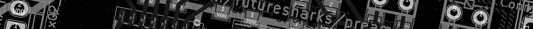

# PCBs and schematics

* [MDAC attenuator](mdac-attenuator): A digital attenuator
* [Input selector](input-selector): Relay based input selector
* [Encoder panel](encoder-panel): Holds rotary encoder and LED ring
* [Power Supply 5V](psu-digital): Power supply for digital components.
* [Power Supply +/- 15V](psu-analog): Power supply for MDAC attenuator
* [Micro controller board](mcu-board): Holds the micro controller and other connectors
* [RCA panel](rca-panel): For the RCA sockets and connectors
