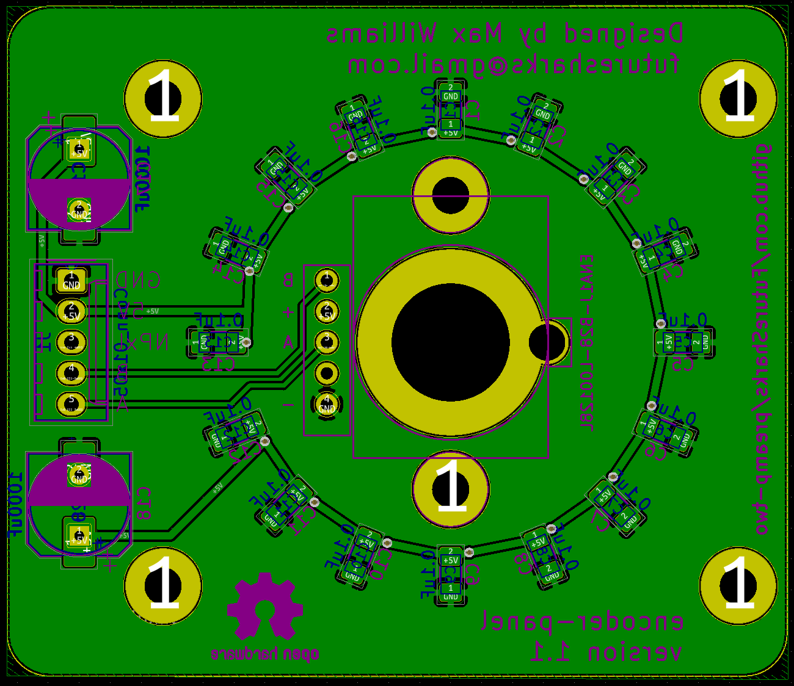

# Encoder Panel

The module is the sole human interface to the preamp. It consists of 2 things:

- A high quality optical encoder for changing of the volume and input
- A ring of [NeoPixels](https://learn.adafruit.com/adafruit-neopixel-uberguide/the-magic-of-neopixels) as a visual indicator and to give feedback

## Photos

##  Code

Python module is here: [code/modules/encoder_panel.py](../../code/modules/encoder_panel.py)

## Schematic

## Layout

## BoM

| Reference  | Quantity | Value       | Footprint                                                      |
|------------|----------|-------------|----------------------------------------------------------------|
| C1-16      | 16       | 0.1uF       | Capacitor SMD 1206      |
| C17, C18   | 2        | 1000uF      | Capacitor SMD 8x5.4 or Capacitor THT D8.0mm P5.00mm |
| D1-16      | 16       | WS2812B     | LED SMD WS2812B                   |
| J1         | 1        | Conn_01x05  | Molex_KK-254_AE-6410-05A_1x05_P2.54mm_Vertical |
| R1         | 1        | 500R        | Resistor SMD 1206 |
| U1         | 1        | ENA1J-B28   | Bourns ENA1J-B28-L00128L                                       |
