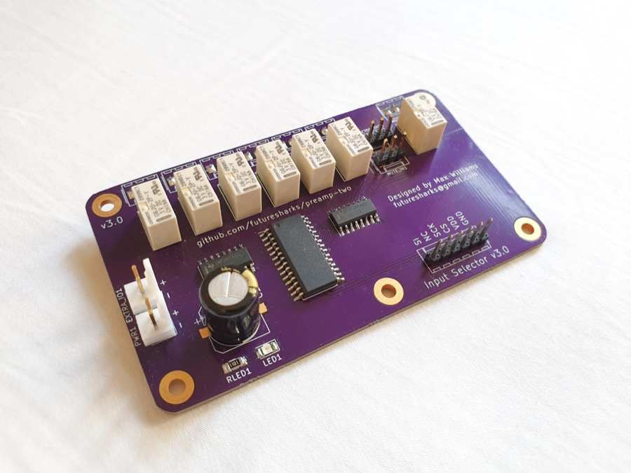
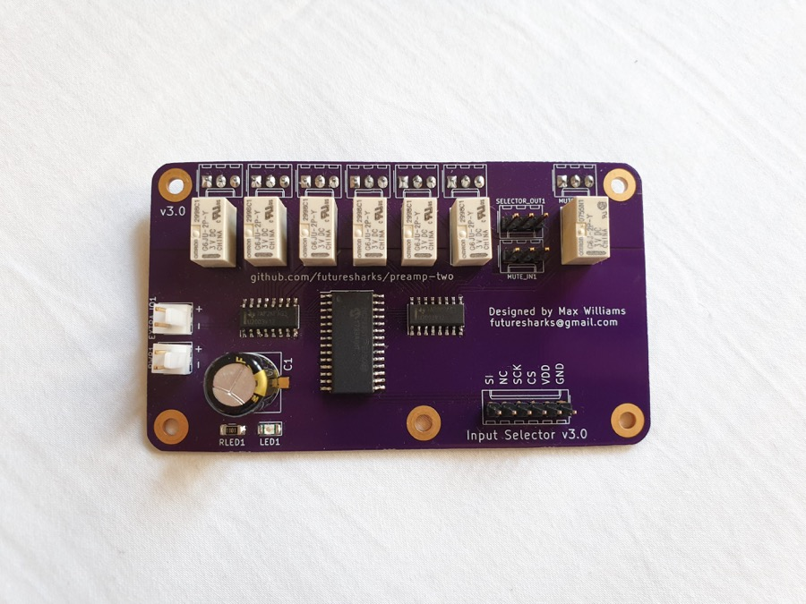
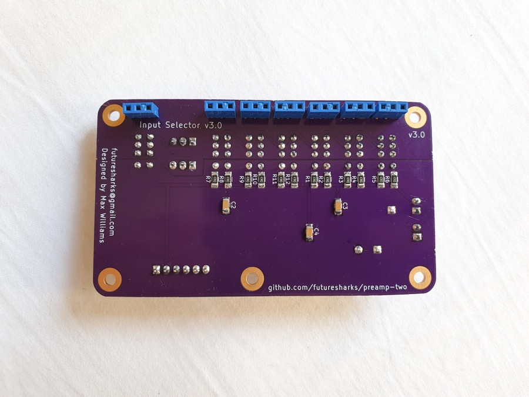
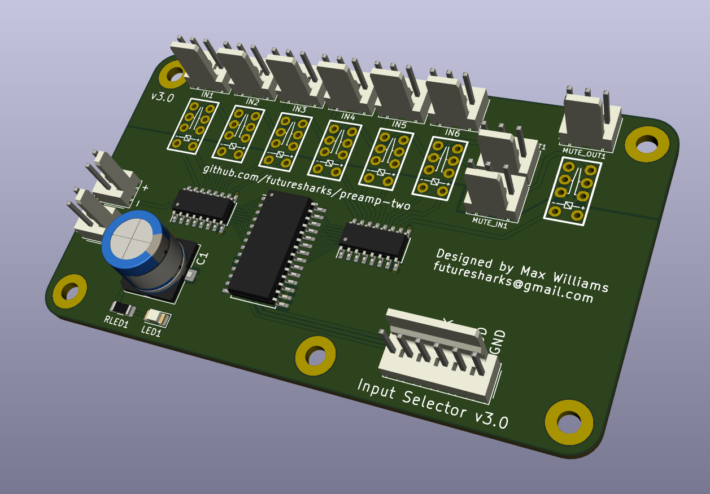
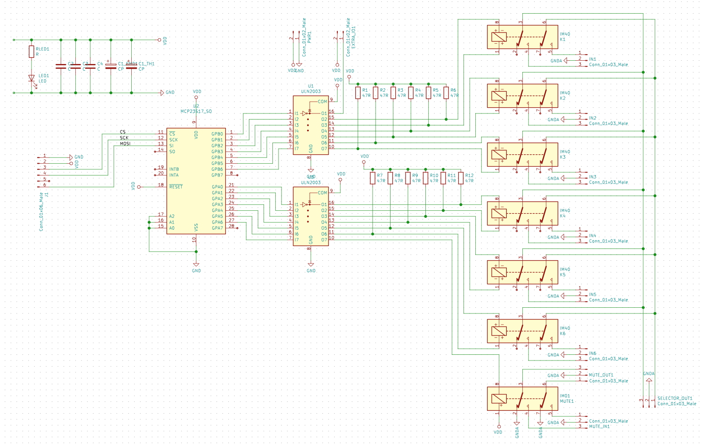
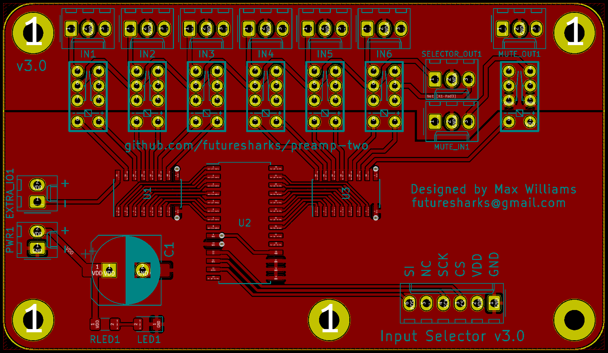
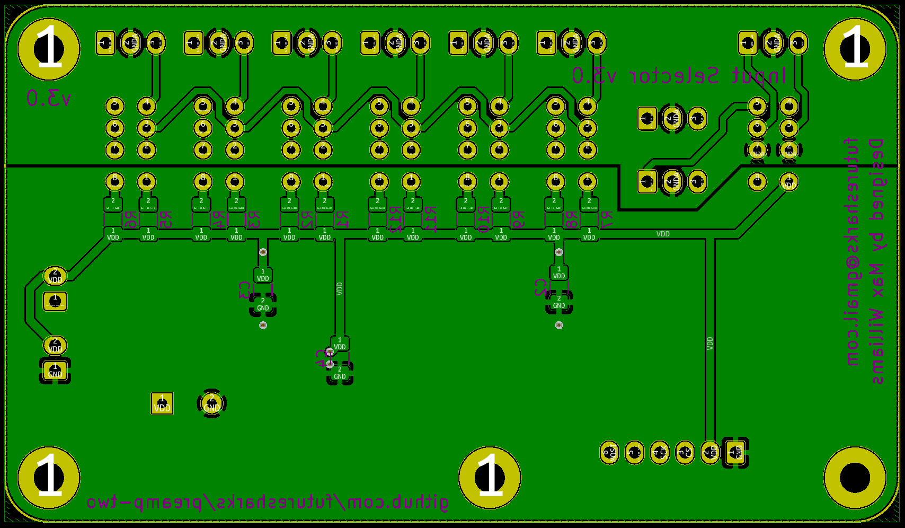

# Input Selector

* 6x inputs
* Mute for output
* SPI controlled using a MCP23S17
* Latching relays for low current draw
* Compatible with 5V and 3V relays
* Uses high quality Panasonic relays
* Stackable with [RCA panel](../rca-panel) and [MDAC attenuator](../mdac-attenuator)

## Photos

##  Code

Python module is here: [code/modules/input_selector.py](../../code/modules/input_selector.py)

## Schematic

## Layout

## BoM

| Reference                                 |  Quantity |  Value    |  Footprint / Notes |
|-------------------------------------------|-----------|-----------|-----------------|
| C2, C3, C4                                | 3         | 100nF | 1206 |
| C1_SMD                                    | 1         | 100uF | Radial 10/5mm or SMD, 10V or higher |
| IN1-6, MUTE_IN1, MUTE_OUT1, SELECTOR_OUT1 | 9         | 1x3 | Molex KK 254, Multicomp MC34 or any 0.1" socket header |
| J1                                        | 1         | 1x6 | Molex KK 254, Multicomp MC34 or any 0.1" socket header |
| EXTRA_IO1, PWR1                           | 2         | 1x2 | Molex KK 254, Multicomp MC34 or any 0.1" socket header |
| K1-K6                                     | 6         | G6JU-2P-Y-DC3 | 3V latching coil. e.g. Omron G6J, Panasonic AGN or Tyco IM narrow |
| MUTE1                                     | 1         | G6J-2P-Y-DC3 | 3V non-latching coil. e.g. Omron G6J, Panasonic AGN or Tyco IM narrow |
| R1-9                                      | 12        | 47R | 1206 |
| RLED1                                     | 1         | 1K   | 1206 |
| LED1                                      | 1         | - | 1206 |
| U1, U3                                    | 2         | ULN2003V12DR | SOIC-16 |
| U2                                        | 1         | MCP23S17-E/SO | SOIC 28 wide |
