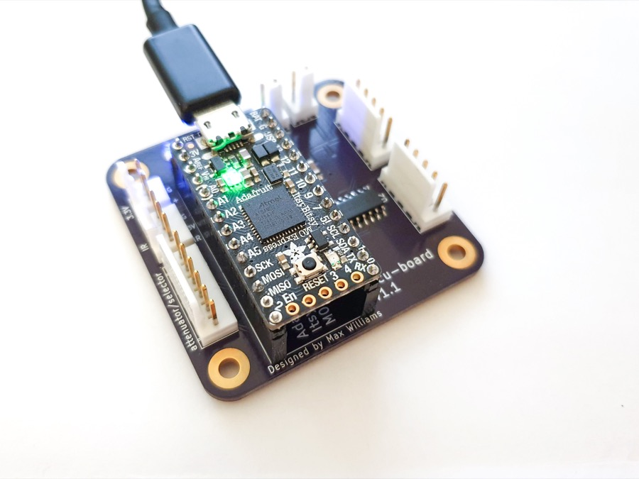
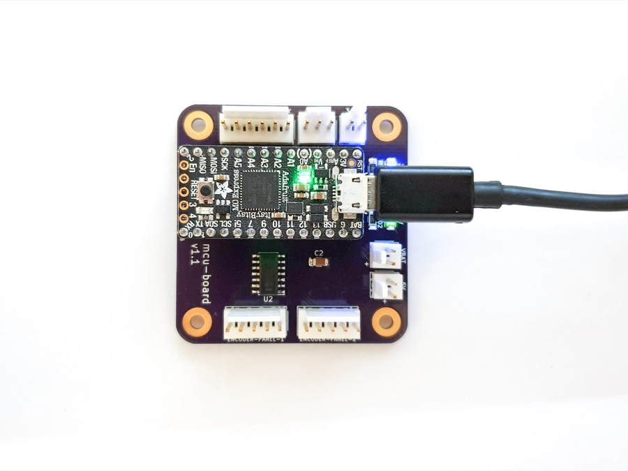
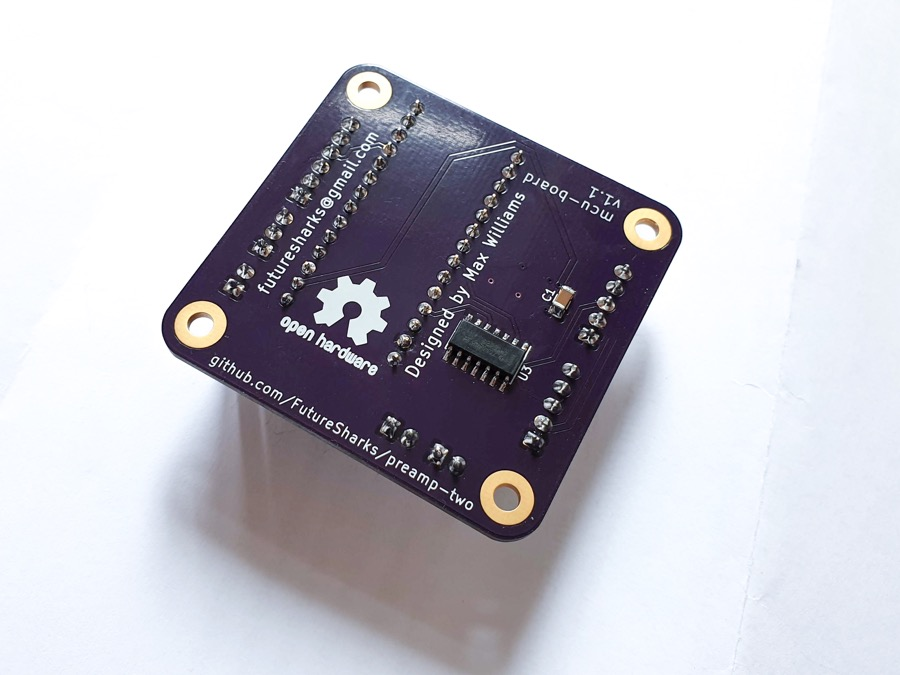
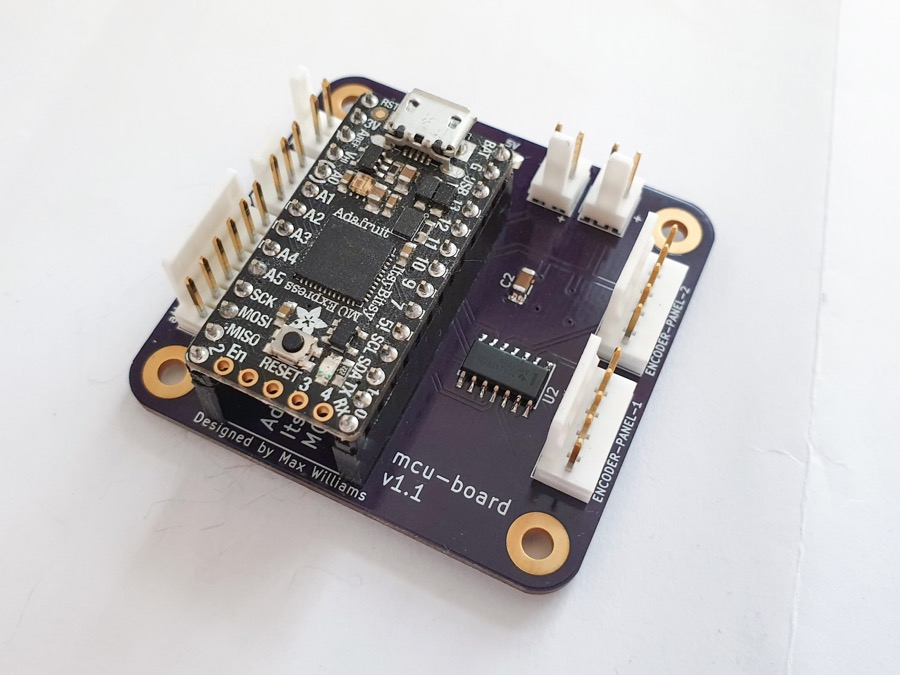
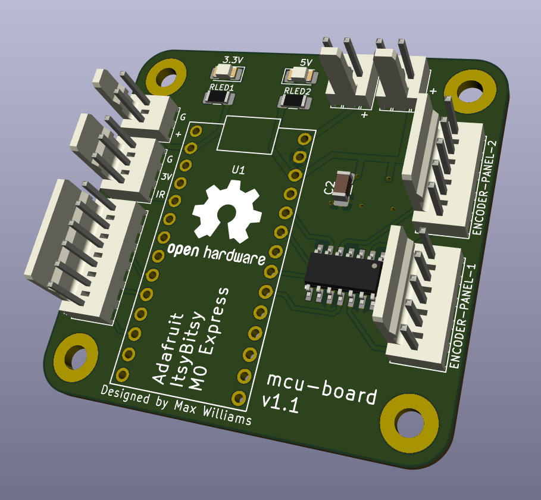
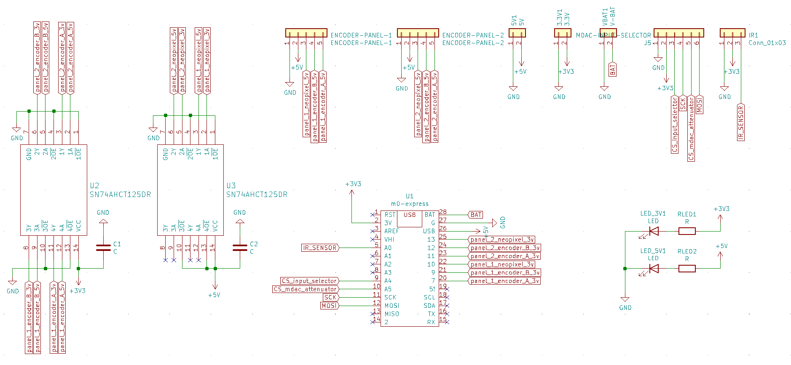
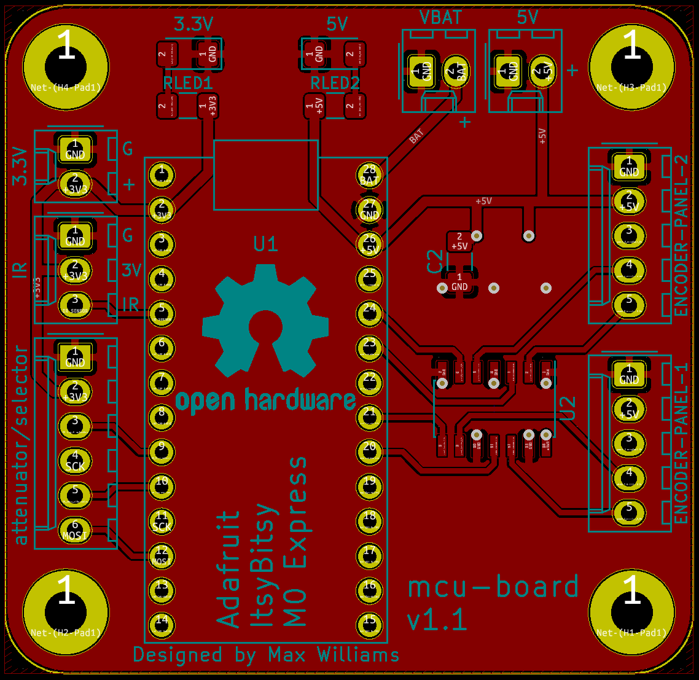
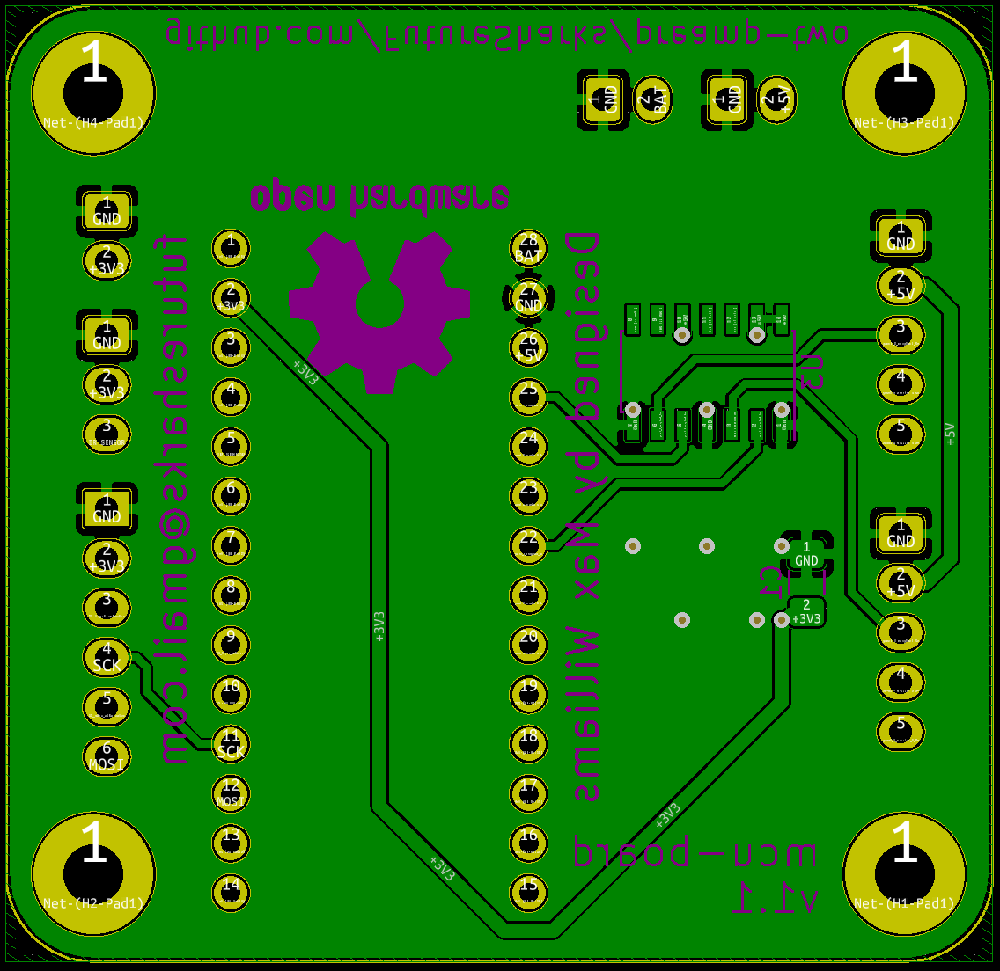

# Micro controller board

The PCB holds the [Adafruit ItsyBitsy M4 Express](https://learn.adafruit.com/introducing-adafruit-itsybitsy-m4), connectors and level shifters. The MDAC attenuator, input selector, both encoder panels and power digital power supply all connect to this PCB.

## Photos

##  Code

The main python code is here: [main.py](../../code/main.py)

## Schematic

## Layout

## BoM

| Reference        | Quantity | Value                    | Footprint                                                      |
|------------------|----------|--------------------------|----------------------------------------------------------------|
| U1               | 1        | m0-express               | Adafruit ItsyBitsy M4 Express                      |
| U2, U3           | 2        | SN74AHCT125D             | Package_SO:SOIC-14_3.9x8.7mm_P1.27mm                           |
| LED_3V1, LED_5V1 | 2        | LED                      | LED SMD 1206    |
| RLED1, RLED2     | 2        | R                        | Resistor SMD 1206    |
| C1, C2           | 2        | C                        | Capactior SMD 1206      |
| ENCODER-PANEL-1  | 1        | ENCODER-PANEL-1          | Molex_KK-254_AE-6410-05A_1x05_P2.54mm_Vertical |
| ENCODER-PANEL-2  | 1        | ENCODER-PANEL-2          | Molex_KK-254_AE-6410-05A_1x05_P2.54mm_Vertical |
| IR1              | 1        | Conn_01x03               | Molex_KK-254_AE-6410-03A_1x03_P2.54mm_Vertical |
| J5               | 1        | MDAC-INPUT-SELECTOR      | Molex_KK-254_AE-6410-06A_1x06_P2.54mm_Vertical |
| 3.3V1            | 1        | 3.3V                     | Molex_KK-254_AE-6410-02A_1x02_P2.54mm_Vertical |
| 5V1              | 1        | 5V                       | Molex_KK-254_AE-6410-02A_1x02_P2.54mm_Vertical |
| VBAT1            | 1        | V-BAT                    | Molex_KK-254_AE-6410-02A_1x02_P2.54mm_Vertical |
