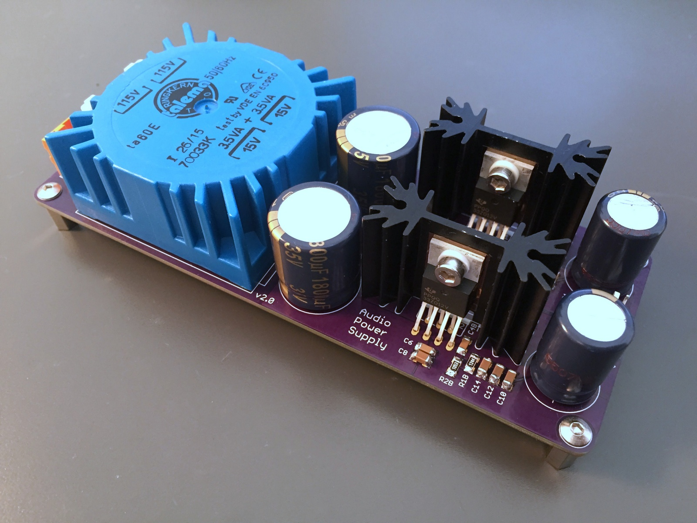

# Analog Power Supply

This the +/- 15V power supply. It powers the op-amp in the MDAC attenuator using TPS7A3301 regulators.

The PCB files are in Eagle format.

## Photos

## Schematic

## Layout

## BoM

|  Part name | RS part          | Farnell Part | Mouser Part          | Description                                                     | EVM Part name | Notes                |
| ---------- | ---------------- | ------------ | -------------------- | --------------------------------------------------------------- | ------------- | -------------------- |
| C1/C2      | 571319           |              | 667-EEU-FC1V182S     | Large input cap, 7.5mm/18mm                                     | -             |                      |
| C5/C6      | -                |              | 80-C1206C104K5R      | 1206, 0.1uF, X5R or X7R                                         | -             |                      |
| C7/C8      | 7900610          |              | 81-GRM31CR61H106KA2L | 1206, 47uF, X5R or X7R, 2220 package                            | C1            |                      |
| C3A/B      | 7236657          |              | 81-GRM31MR71H105KA88 | 1206, 1uF, X5R or X7R                                           | C3            | NR/SS                |
| C4A/B      | 2644141          |              | 80-C1206C103K1R      | 1206, 10nF/0.01uF, X5R or X7R                                   | C4            | CFF/CBYP             |
| C9-14      | 7900610          |              | 81-GRM31CR61H106KA2L | 1206, 22-15uF, multiple, 2220 package                           | C5-C9         | Total at least 47uF  |
| C15/C16    | 571408 or 571290 |              | 667-EEU-FC1E102      | Large output cap, 5mm/13mm                                      | C10           |                      |
| R1A/B      |                  |              | 667-ERJ-8ENF1244V    | 1.24M                                                           | R1            | Value for -15VDC     |
| R2A/B      |                  |              | 667-ERJ-8ENF1053V    | 105K                                                            | R2            | Value for -15VDC     |
| B1/2       | 8148800          | 1336500      | 625-DFL1508S-E3/77   | VISHAY - DFL1508S-E3/45, BRIDGE RECTIFIER                       |               |                      |
| IC1/IC2    |                  |              | 595-TPS7A3301KC      | LDO Voltage Regulators -3 to -36V,-1A,Ultra Low Noise,High PSRR |               |                      |
| TR1        | 2239216          |              |                      | Block FL6/FL8, Talema/Amveco 5/7VA or standard EI-42            |               |                      |
| F1         | 7874164          |              | 576-64900001039      | 5x20mm Fuseholder 6.3A 250V                                     |               |                      |
| AC         | 403932           |              |                      | 5.08mm Pitch 2 Way 1 Row Straight PCB Header                    |               | AC in                |
| KK1/KK2    |                  |              | 532-513002B25G       |                                                                 |               | Heatsinks, SK104-PAD |
| LED        | -                | -            | -                    | Any 1206 LED                                                    |               |                      |
| RLED       | -                | -            | -                    | To match LEDs                                                   |               |                      |
| X2         |                  |              |                      |                                                                 |               | Power out            |
| Fuse       |                  |              | 530-5ST63-R          | 5x20mm, 63mA                                                    |               |                      |
