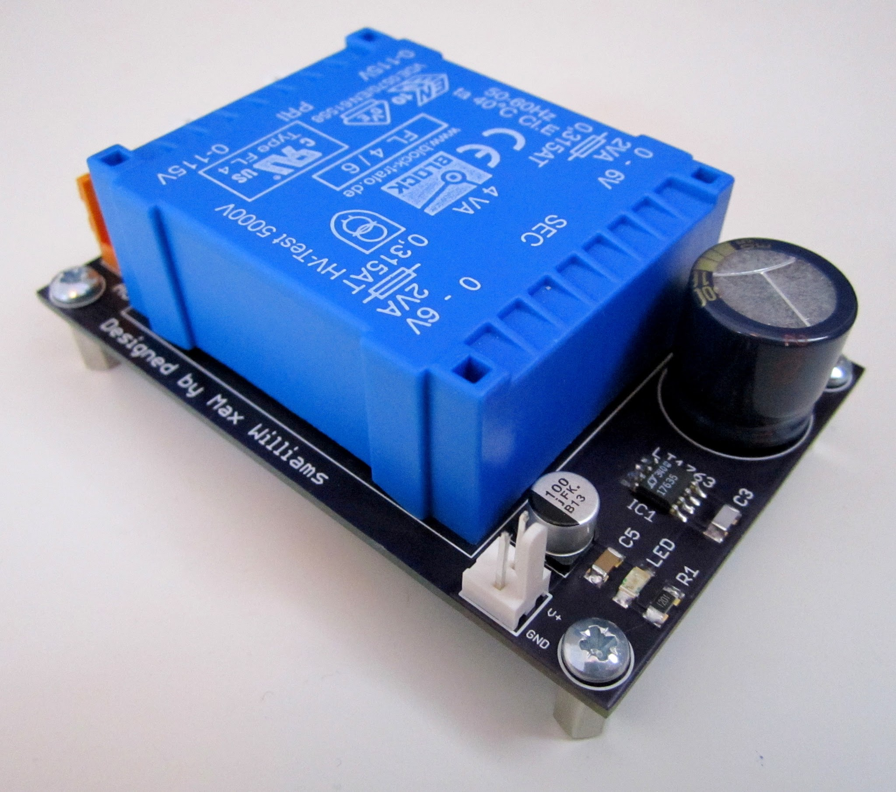
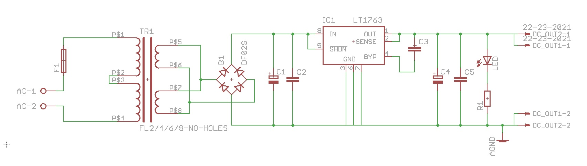
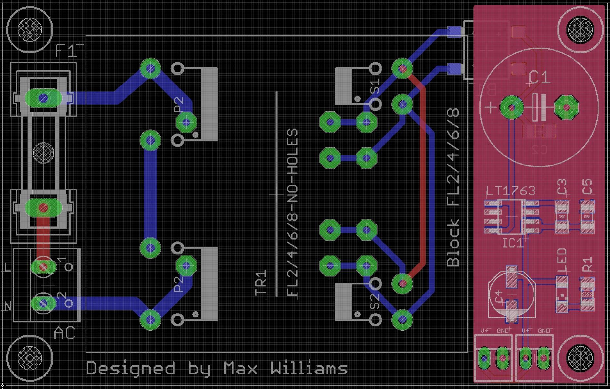

# Digital Power Supply

This the 5V digital power supply. It powers the input selector, digital part of the MDAC attenuator, the NeoPixels in the encoder panels and the encoders.

It uses a LT1763 regulator.

The PCB files are in Eagle format.

## Photos

## Schematic

## Layout

## BoM

| Reference   | Footprint / Notes  |
|-------------|--------------------|
| F1 | Fuse holder. |
| TR1 | Pads for Block FL2/FL4/FL6/FL8 or EI38 or EI30. Ideally 2x 6VAC. |
| B1 | VISHAY DFL1508S bridge rectifier. |
| C1 | Panasonic FC 1500UF, 16V. |
| L1 | INDUCTOR, 1210 CASE, 10UH. |
| L2 | FERRITE BEAD, 0.1OHM, 2A, 1206. |
| C2 | 100nF X7R, 1206 package. |
| IC1 | LT1763CS8-5, 5V fixed regulator. |
| C3 | C0G/NP0, 10NF, 100V, 1206 package. |
| C4 | Panasonic FK 100UF, 6.3V, SMD. |
| C5 | 100nF X7R, 1206 package. |
| R1 | Resistor for LED, 1206 package. |
| LED | 1206 LED |
