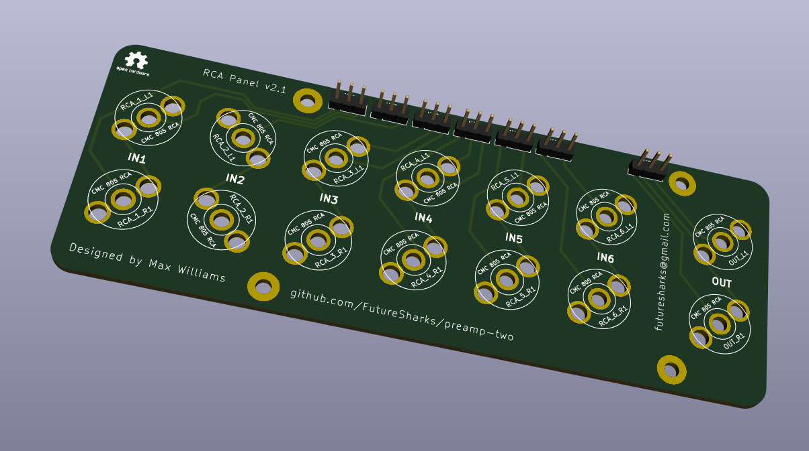
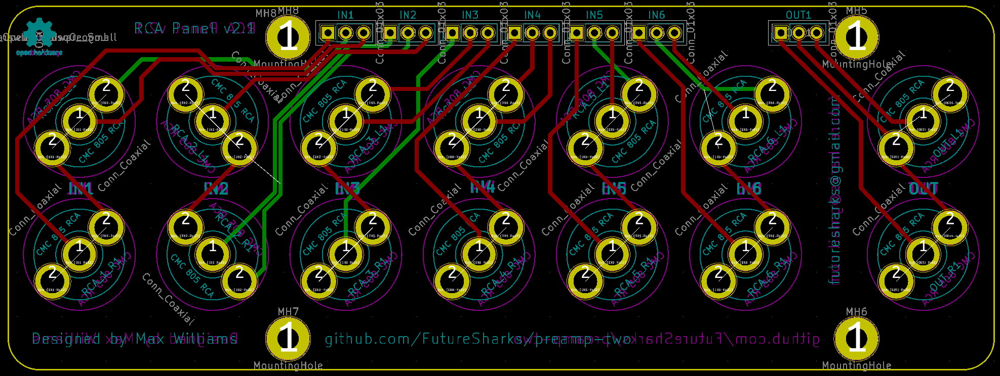

# RCA Panel

This PCB provides mounting for the RCA sockets and connects with the [input selector](../input-selector).

The RCA sockets are [CMC](http://www.audio-cmc.com/rca-jacks-c.html) 805 model.

## Photos

## Schematic

## Layout

## BoM

| Reference   |  Quantity |  Value  |  Footprint / Notes  |
|-------------|-----------|---------|-------------|
| IN1-6, OUT1 | 7         | 1x3     | Molex KK 254, Multicomp MC34 or any 0.1" socket header |
| RCAs        | 14        | -       | Any CMC USA 805 |
