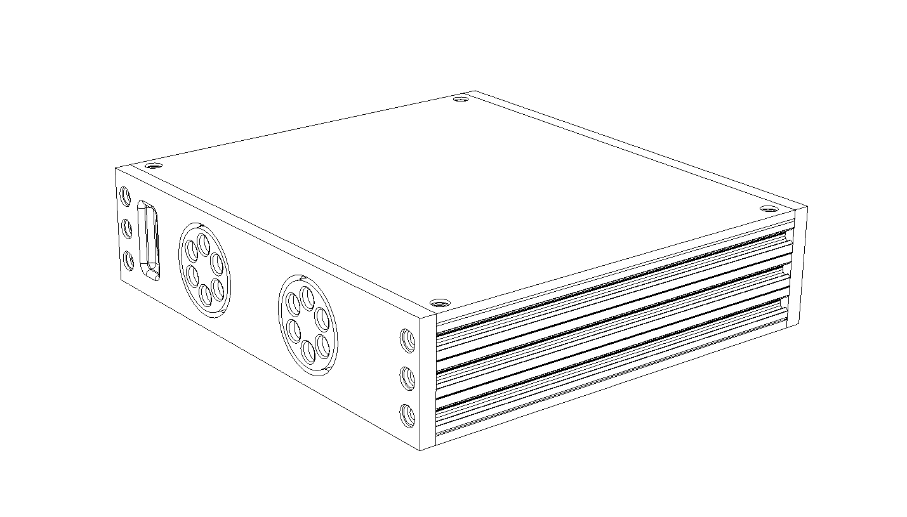

# Preamp Two

Here is my Hi-Fi preamplifier project. In this repository you can find schematics, PCB layouts, CircuitPython code, BoMs, measurements and photos.

Features:

* MDAC volume controller
* 6 way relay based input selector
* High performance design with measurements
* Quality components and modular design
* Completely digitally controlled
* All open source and written in Python

## Components and code

The preamplifier is made up of a number of connected components:

* MDAC attenuator ([PCB](PCBs/mdac-attenuator), [code](code/modules/mdac_attenuator.py)): Controls the volume
* Input selector ([PCB](PCBs/input-selector), [code](code/modules/input_selector.py)): Selects the input
* Encoder panel ([PCB](PCBs/encoder-panel), [code](code/modules/encoder_panel.py)): Holds rotary encoder and LED indicator ring
* Power Supply 5V ([PCB](PCBs/psu-digital)): Power supply for digital components.
* Power Supply +/- 15V ([PCB](PCBs/psu-analog)): Analog Power supply for MDAC attenuator
* Micro controller board ([PCB](PCBs/mcu-board), [code](code/main.py)): Holds the [Itsy Bitsy M4 Express](https://learn.adafruit.com/introducing-adafruit-itsybitsy-m4?view=all) and other connectors
* RCA panel ([PCB](PCBs/rca-panel)): For the RCA sockets and connectors

The PCBs and schematics were created in [KiCad](http://kicad.org/) and the code that runs on the micro controller is [CircuitPython](https://circuitpython.org/).

## Enclosure

Diagrams, CAD files and other information can be found here: [enclosure](enclosure)

## Measurements

THD, S/N ratio and power consumption: [measurements](measurements)

## Prototypes and testing

See here for a number of different [prototypes](prototypes). All PCBs were made by [OSH Park](https://oshpark.com/).

## Photos

---

            
