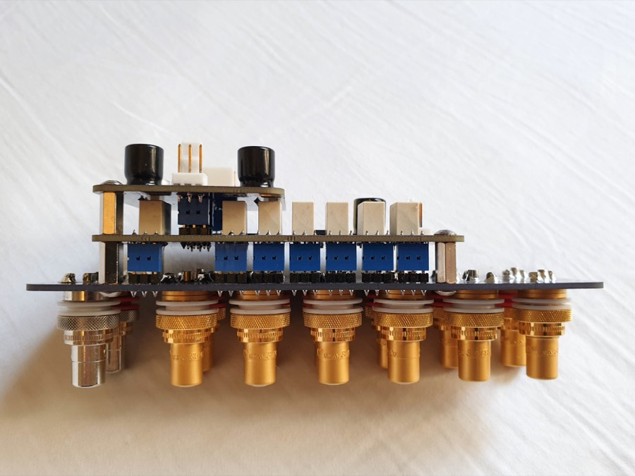
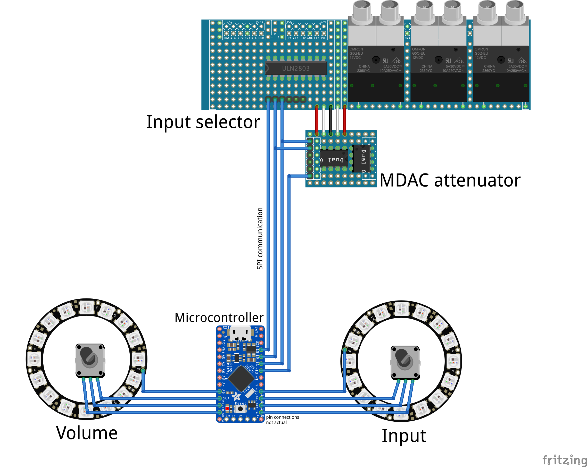

# Preamp Two

Here is my project to build a Hi-Fi preamplifier. This repository includes schematics, PCB layouts, CircuitPython code, BoMs, measurements and photos.

Features:

* High performance design with measurements
* Quality components
* Completely digitally Controlled
* Modular design
* All open source

### Components

The preamplifier is made up of a number of connected components:

* MDAC attenuator ([PCB](https://github.com/FutureSharks/preamp-two/tree/master/PCBs/mdac-attenuator), [code](https://github.com/FutureSharks/preamp-two/tree/master/code/modules/mdac_attenuator.py)): Controls the volume
* Input selector ([PCB](https://github.com/FutureSharks/preamp-two/tree/master/PCBs/input-selector), [code](https://github.com/FutureSharks/preamp-two/tree/master/code/modules/input_selector.py)): Selects the input
* Encoder panel ([PCB](https://github.com/FutureSharks/preamp-two/tree/master/PCBs/encoder-panel), [code](https://github.com/FutureSharks/preamp-two/tree/master/code/modules/encoder_panel.py)): Holds rotary encoder and LED indicator
* Power Supply 5V ([PCB](https://github.com/FutureSharks/preamp-two/tree/master/PCBs/psu-digital)): Power supply for digital components.
* Power Supply +/- 15V ([PCB](https://github.com/FutureSharks/preamp-two/tree/master/PCBs/psu-analog)): Power supply for MDAC attenuator op-amp
* Micro controller board ([PCB](https://github.com/FutureSharks/preamp-two/tree/master/PCBs/mcu-board)): Holds the micro controller and other connectors
* RCA panel ([PCB](https://github.com/FutureSharks/preamp-two/tree/master/PCBs/rca-panel)): For the RCA sockets and connectors

The PCBs and schematics were created in [KiCad](http://kicad-pcb.org/) and the code that runs on the micro controller is [CircuitPython](https://learn.adafruit.com/welcome-to-circuitpython/what-is-circuitpython).

            

### Prototypes and testing

See here: [images/prototypes](images/prototypes)

PCBs made by [OSH Park](https://oshpark.com/).
