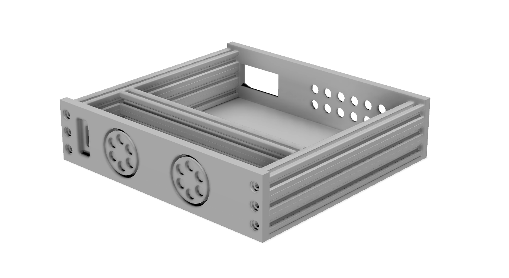

# Enclosure

The enclosure is based around 2060 extrusion profile. You can buy it at many places. I bought mine [from Aliexpress](https://www.aliexpress.com/wholesale?SearchText=2060%20extrusion) where many sellers will cut custom lengths. It's a great thing to build things from because it's relatively cheap, you can tap an M6 thread into the ends and there's many brackets and attachments available specifically for the whole family of 20xx extrusions.

## CAD files

Knobs and bearing bracket were made by [Shapeways](https://www.shapeways.com/).

Fusion 360 archive file: [preamp-two-enclosure.f3d](https://github.com/FutureSharks/preamp-two/raw/master/enclosure/preamp-two-enclosure.f3d)

STL of front: [front.stl](front.stl)

STL of rear: [rear.stl](rear.stl)

STL of knob: [knob.stl](knob.stl)

STL of knob and bearing bracket: [bearing-bracket.stl](bearing-bracket.stl)

## Photos

