# Prototypes and testing

I made quite a few test module and prototypes before settling on the current design. Some were successful and others were total failures. I was most interested in having a non-screen based touch interface, either with capacitive sensors or with light sensors. But I couldn't get this to be reliable.

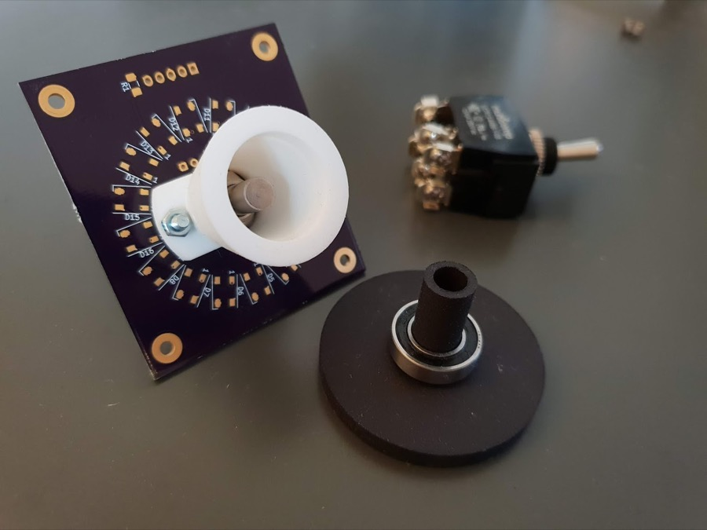

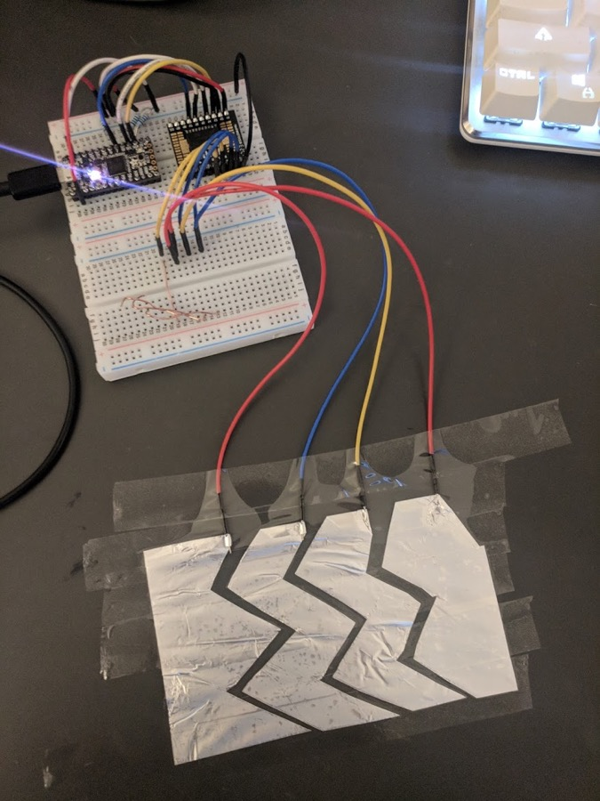

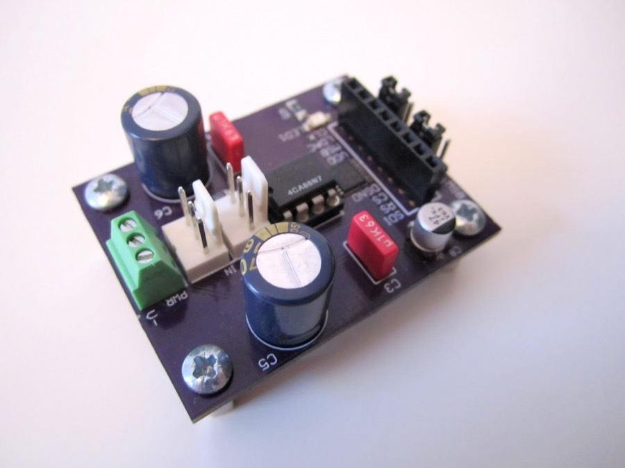

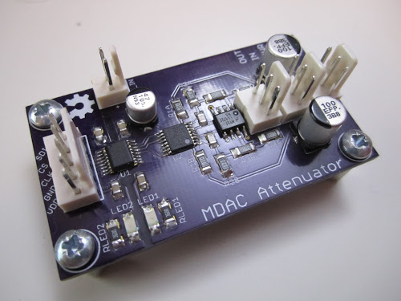

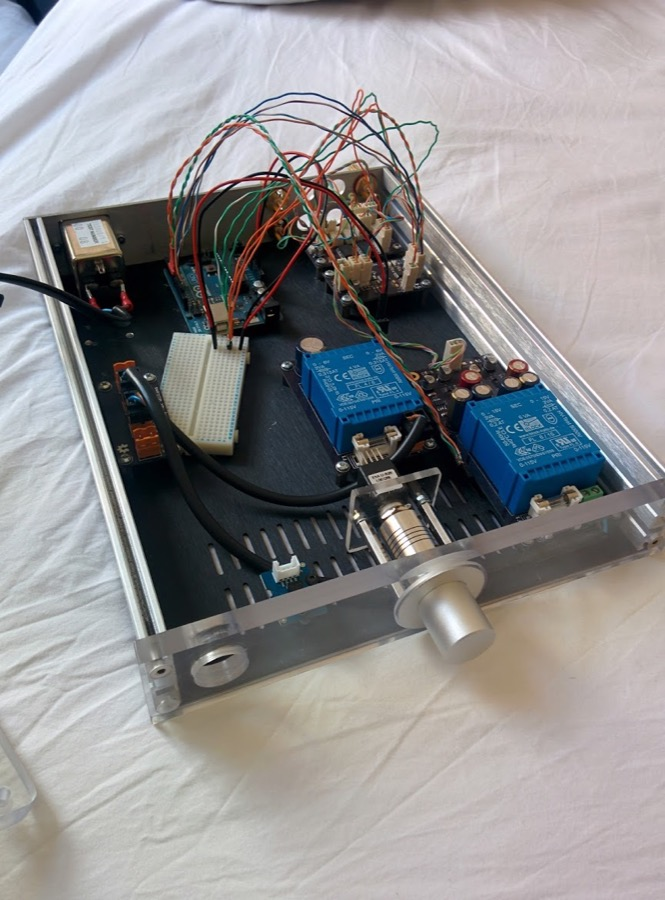

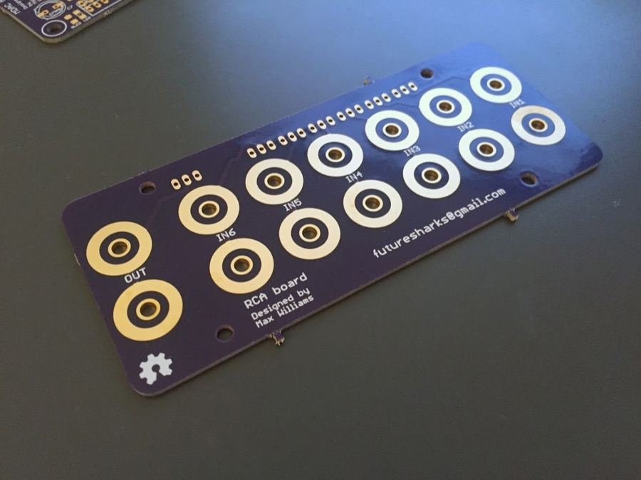

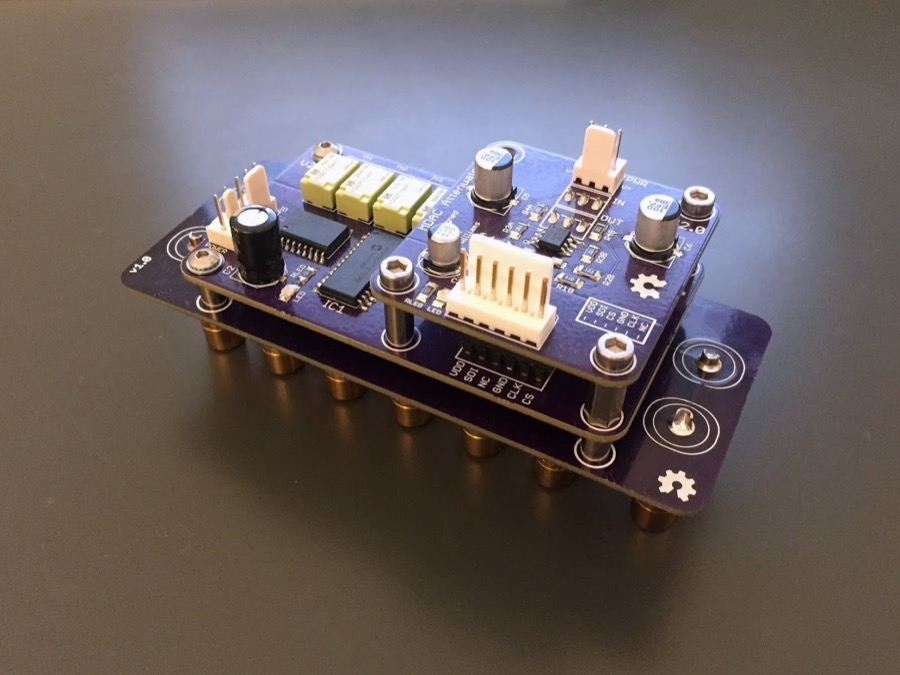

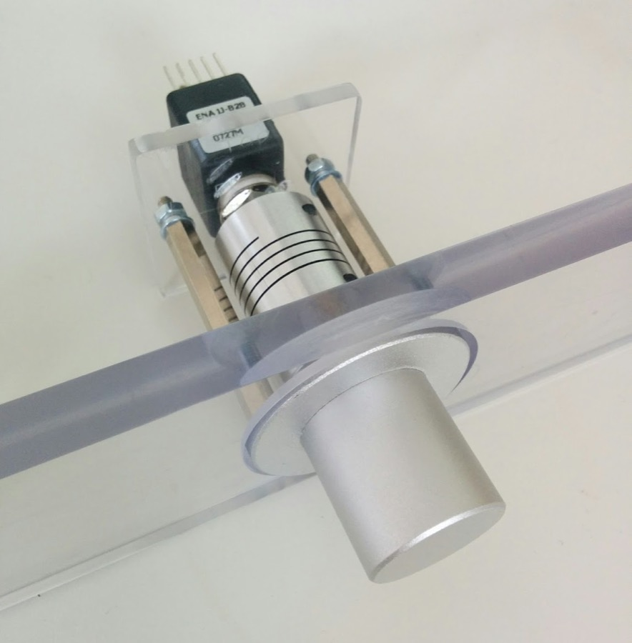

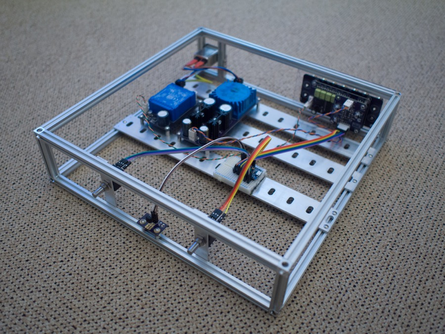

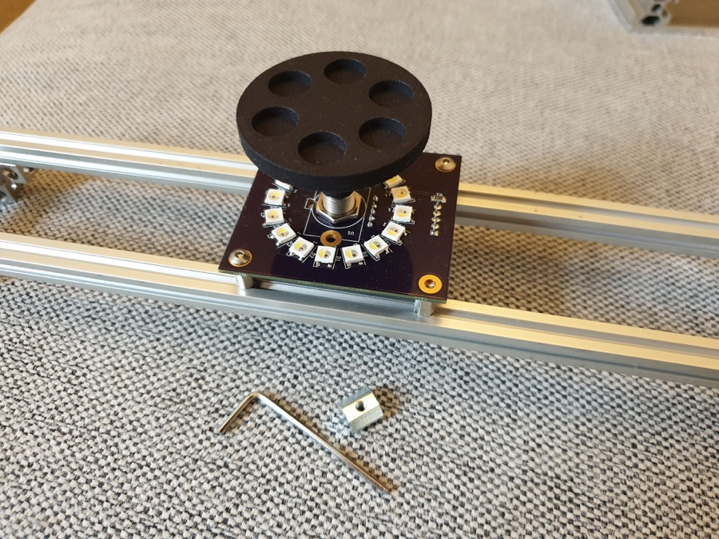

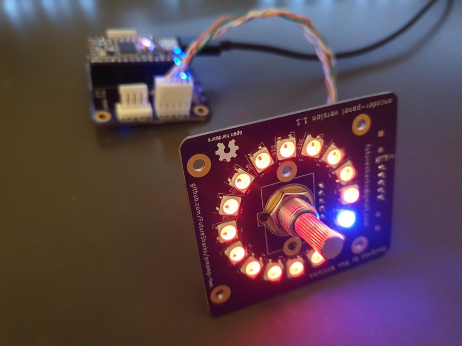

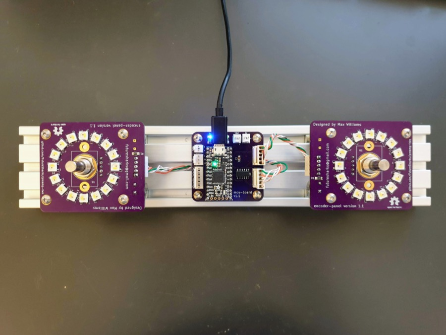

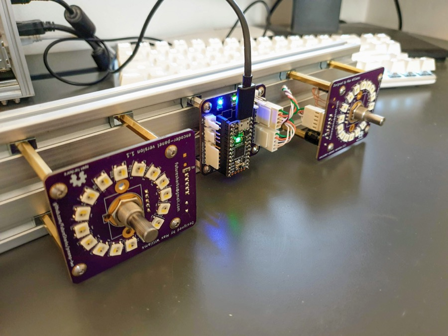
